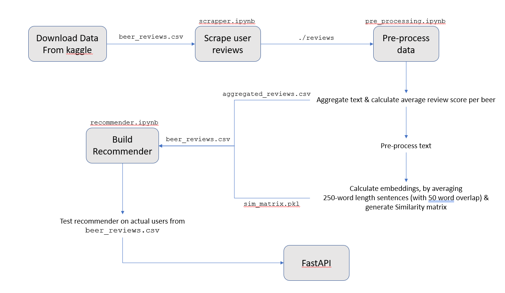
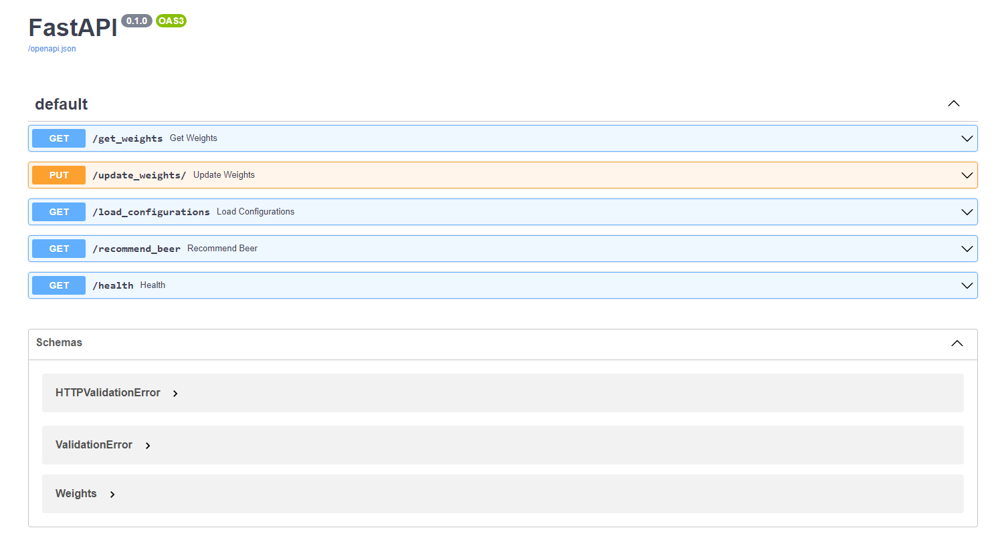
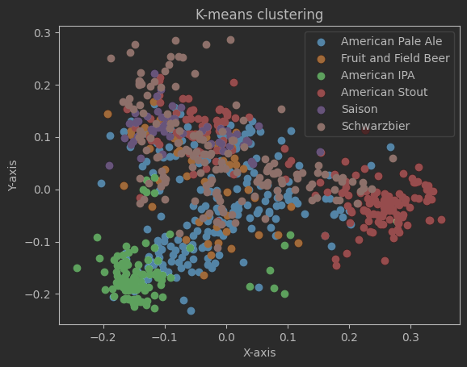

# Description

* Find a dataset that can be used to inform a content-based recommender systems.

* Email me your dataset of choice to confirm before working on your recsys.

* Build a Python Notebook that:

(1) Loads the dataset

(2) Creates a content-based recommender system.

(3) Uses quantitative metrics to evaluate the recommendations of the system.


# Introduction
The order to run this project is presented below. The only pre-requisite in the `beer_reviews.csv`, 
which is the original dataset downloaded from Kaggle.

Using `beer_reviews.csv` the project may be executed end-to-end by running the notebooks 
in the following order:

* `scrapper.ipynb`: this will create the `reviews` directory, which contains one `csv` file for each beer with the reviews
* `pre_processing.ipynb`: this notebook takes as input the `reviews` folder, as well as the `beer_reviews.csv` file
and performs data pre-processing by aggregating the review text into a string
  (with `ntlk` cleaning) and calculates the rating's mean and std. 
The output is a csv named `aggregated_reviews_small.csv`. 
Moreover, this notebook generates two embeddings `pkl` files. The `embeddings.pkl` and the `sim_matrix.pkl`. 
* The `aggregated_reviews_small.csv`,  `sim_matrix.pkl` and `beer_reviews.csv` are used in the `recommender.ipynb` file
which is used to build the recommender system, and test the recommendations on the original users.

An overview may be found below:


# FastAPI
A lightweight API was build in order to recommend beers based on an input beer name.
The API is implemented using uvicorn+fastAPI and creates four endpoints which will be explained
in detail below. The required files for the API to run are:

* `aggregated_reviews_small.csv`
* `sim_matrix.pkl` 
* `beer_reviews.csv`

For local dev the API can be triggered using the below command from terminal in the project directory:

```uvicorn beer_rec:app --reload```

The endpoints may be accesed through a 3rd party service, like Postman, or locally under `localhost:8000`.

## FastAPI - Endpoints



* `/load_configurations`: As mentioned the API uses three configuration files. These files are loaded on startup in the 
`/load_configurations` endpoints. To make the API more realistic, the user can change these configurations, 
in case a new beer is added, for example


* `/health`: The typical health endpoint also checks the status of the configuration files and returns "UP"
if the files are cached (error code: 200) else "DOWN" with error code 400 for each missing file:
```
{
  "aggregated_reviews_small.csv": 200,
  "./pkl_files/sim_matrix.pkl": 200,
  "beer_reviews.csv": 200,
  "status": "UP"
}
```

* `/get_weights`: The endpoint prints the weights currently in use, which determine how the beer similarity 
is calculated.
```
{
  "brewery_name": 0.5,
  "beer_abv": 1,
  "country": 0.2,
  "beer_style": 1,
  "score": 1,
  "rating_mean": 1,
  "reviews": 1
}
```

* `/update_weights`: The user can send a dictionary in oder to update the weights. An error message is returned
in case an invalid value is provided (not in [0, 1])

**Sample input (invalid):**
```
{
  "brewery_name": 3,
  "beer_abv": 1,
  "country": 0.2,
  "beer_style": 1,
  "score": 1,
  "rating_mean": 1,
  "reviews": 1
}
```
**Output:**
```
{
  "status": "FAILURE",
  "message": "Weight Values should be between 0 and 1"
}
```


* `/recommend_beer`: This is the main endpoint of the application. The user can specify a beer, along with 
the number of recommendations (default is 5). The suggested beer to test is: 

```Founders KBS (Kentucky Breakfast Stout)```

A sample response may be found below:
```
{
  "Recommendations": {
    "Hunahpu's Imperial Stout": {
      "brewery_name": "Cigar City Brewing",
      "beer_style": "American Imperial Stout",
      "beeradvocate_link": "https://www.beeradvocate.com/beer/profile/17981/47022/"
    },
    "Ten FIDY": {
      "brewery_name": "Oskar Blues Grill & Brew",
      "beer_style": "American Imperial Stout",
      "beeradvocate_link": "https://www.beeradvocate.com/beer/profile/2681/34483/"
    },
    "Serpent's Stout": {
      "brewery_name": "The Lost Abbey",
      "beer_style": "American Imperial Stout",
      "beeradvocate_link": "https://www.beeradvocate.com/beer/profile/18149/37197/"
    },
    "Mokah": {
      "brewery_name": "Southern Tier Brewing Company",
      "beer_style": "American Imperial Stout",
      "beeradvocate_link": "https://www.beeradvocate.com/beer/profile/3818/49286/"
    },
    "Beer Geek Brunch Weasel": {
      "brewery_name": "Mikkeller ApS",
      "beer_style": "American Imperial Stout",
      "beeradvocate_link": "https://www.beeradvocate.com/beer/profile/13307/46987/"
    }
  }
```


# Dataset

## Scraping

Having used the reviews from [beeradvocate](https://www.beeradvocate.com/) in the first part of the project
we decided to work with the same site for the second part. 
Unfortunately, the original dataset didn't have the text reviews, 
along with some other metrics that we found useful. 

For this reason the `.\scrapper.ipynb` notebook was created to scape some additional information
of the most popular beer of the original dataset. Each beer was saved into a `{beer_id}_{brewery_id}.csv` file. 
approximately half a million reviews were scraped over the period of three days.
Due to limited resources and getting an account banned once we could not affort scaping more reviews

A detailed `log.txt` file which showed the progress of the scraping is also provided.

## Pre-processing

Since this is a content-based recommender system we decided to combine the reviews, by aggregating all user reviews
into a single one, for each beer, in order to create embeddings for each beer. 
 This was achieved by creating a big string text which was then 
split into list of 250 length. Each list overlapped with the previous one
for 50 words. An embedding for each 250-word length list was created, 
and the embeddings were averaged for each beer. 

This resulted in one embedding for each beer. In order to visualize the results, 
we ran a 2D PCA along with a K-means clustering algorithm. After finding the optimal k, 
we decided to find a beer-style representative each cluster. 

The result can be found in the picture below:

